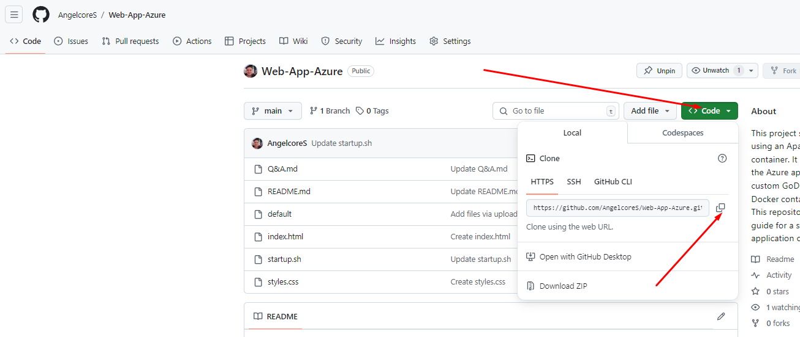

<h1>Building a Website Blog in Azure WebApp: Step-by-Step Guide </h1>

In this tutorial, I'll walk you through the steps I took to create a fully functional website blog deployed on Azure WebApp. Throughout this process, I sharpened my skills in HTML, CSS, and gained hands-on experience with web servers, specifically NGINX. One of the most significant challenges I faced was configuring a custom domain using DNS, which required me to bind the domain to the Azure WebApp and ensure secure communication by opening an SSH connection to configure the web server.

I also installed Git to clone my repository, and set up the NGINX configuration through the sites-available/default file to direct traffic properly. Once the configurations were in place, I restarted the NGINX service to apply the changes. To streamline the startup process, I used a bash script (.sh) as a startup command to automate certain tasks.

This tutorial combines both the technical setup and problem-solving skills that helped me overcome various challenges, ensuring a smooth deployment process from code to live website.

While manual deployment may not always be practical due to the availability of frameworks that streamline the process, it was invaluable in strengthening my foundational understanding of how web apps are built and secured.

<h2>Create App Services</h2>

1. Log in to Azure Portal
Visit the Azure Portal and log in using your Azure account credentials.
2. Navigate to App Services
In the Azure Portal, use the search bar at the top and type "App Services."
Click on App Services from the search results.
3. Create New App Service
On the App Services page, click the + Create button (or + Add if applicable).
This will open the "Create Web App" wizard.

5. Configure Basic Settings
Subscription: Choose your Azure subscription.
Resource Group: Either select an existing resource group or create a new one.
Name: Enter a unique name for your app service (this will be part of your app's URL, e.g., myapp.azurewebsites.net).
Publish: Choose either Code (for typical web apps) or Docker (if you're using Docker containers).
Runtime stack: Select the programming language and version you want to use (e.g., .NET, Node.js, PHP, Python, Java). In this case I will use PHP 8.2, when you deploy a PHP application to Azure App Service with PHP 8.x or later, it's likely being served by NGINX by default
Region: Select the geographic region where you want your app to be hosted.

7. Select Basic Pricing Tier (B1)
Plan: Under the App Service Plan section, either select an existing plan or create a new one.
Pricing Tier: Click on Change Size and choose the Basic B1 pricing tier, To bind a custom domain to an Azure App Service, you’ll need at least the Basic B1 pricing tier.
Click Apply to confirm your selection.

8. Configure Deployment Settings (Optional)
If you want, you can configure continuous deployment using GitHub, Bitbucket, Azure Repos, etc. Otherwise, you can skip this step for manual deployment which is what we are going to do in this guide.
9. Review and Create
Review all your settings and make sure everything is configured correctly.
Click the Create button at the bottom of the page.

10. Deployment Process
Azure will now deploy the App Service, which can take a couple of minutes. You can monitor the progress in the Notifications area at the top of the portal.
 

<h2>Bind a Custom Domain</h2>

 
Prepare Your Domain:

Ensure that you have access to a domain name (through providers like GoDaddy, Namecheap, etc.).
You’ll need to manage the DNS settings of your domain to point to your Azure App Service.
Add Custom Domain in Azure:

Once your App Service is on the Basic B1 plan or higher, in the App Service's settings, scroll down to the Settings section and click Custom domains.
Click Add custom domain at the top.
Verify Domain Ownership:

Enter your domain: 

Enter the custom domain you want to bind (e.g., mydomain.com).
 

 
Verify ownership: Azure will ask you to verify ownership of the domain. You can verify in two ways:
 
CNAME Record: Set a CNAME record in your domain's DNS settings to point to the default Azure App Service URL (your-app-name.azurewebsites.net).
 
<b>Azure recommends using CNAME records to map a custom domain (like www.maindomain.com) to an Azure Web App URL (yourapp.azurewebsites.net)</b>
 
TXT Record: Add a TXT record in your DNS settings to prove ownership.
 
Or/and
 
A Record: If using the root domain (e.g., mydomain.com), set an A record pointing to your App Service’s IP address, which can be found in the Custom domains settings.
 
TXT Record: Add a TXT record in your DNS settings to prove ownership.
  

 

 

Once you've added the required DNS records, click Verify in Azure to confirm ownership.

While making your website accessible via both www and no-www versions can enhance user accessibility and flexibility, it introduces complexities that can affect SEO (Search Engine Optimization), security, and maintenance efforts. To maximize benefits and minimize drawbacks, it's advisable to select a primary domain and ensure all traffic is redirected to it.

I recommend setting both CNAME and A records to point to your Azure Web App to handle traffic from both domains, even if you plan to use only one as your primary domain.

I'll explain how to redirect from the root domain (no www) to the www subdomain using the default configuration file of nginx.

In seconds, Azure will bind the certificate and enable HTTPS.

<h2>SSH Manual Deployment</h2>

1. In the Development Tools section, click on SSH. Open the SSH terminal by clicking on Go to SSH.
 

2. Access the App Service's File System via SSH:

Once connected via SSH in the Azure portal, you’ll be inside the Azure App Service container.

<b>Note: Any data outside `/home' is not persisted</b>, this mean any data stored outside /home: Temporary and non-persistent; it is lost on app restarts, scaling, or redeployments.
Navigate to the Web Content Directory:

For App Services, the default content is typically located in the <b>/home/site/wwwroot directory:</b>

`cd /home/site/wwwroot`

Edit the hostingstart.html File:
You should see a file named hostingstart.html in this directory (it is the default web page for newly created App Services).

`nano hostingstart.html`

Modify the file to display "Hello, World!". Replace the content inside the body tag with the following:

Save the File:

After editing the file, press CTRL + X to exit nano, then press Y to confirm changes, and hit Enter to save the file.
Step 4: Verify the Changes
Visit Your Web App:
Open a browser and navigate to your App Service URL:

You should now see the modified hostingstart.html file displaying "Hello World!".

<h2>Deploy Web Blog Sample From Github</h2>

Now that our web server is up and running, I'll walk you through the steps to clone my GitHub repository, which contains the following files: index.html, styles.css, Contact/, startup.sh, and default. I'll explain the purpose of the last two shortly.

Since the git command is not installed, we need to install it first by running:

'apt update && apt install git -y'

Next, copy the HTTPS link to the repository and use the following command:

`git clone <Path that you just copied>`

`cd Web-App-Azure/`

Move the necessary files to the wwwroot directory:

`mv index.html Contact/ styles.css /home/site/wwwroot/`

Finally, open a browser and navigate to your App Service URL:

<h2>The NGINX configuration file</h2>

Now if we click in contact 

You will see that the URL ends with .html extension. omitting file extensions from your URLs enhances security, usability, flexibility, and search engine performance, while also providing a cleaner and more professional appearance for your website.

For that we need to change the nginx file /etc/nginx/nginx.conf

Here we see that the include directive tells nginx to include the contents of the specified file or files at that point in the configuration. This keeps your main nginx configuration file (nginx.conf) clean and manageable.

We are going to edit /etc/nginx/sites-available/, which contains configuration files for all sites that are available on your server. Each file typically represents a separate website or application with its own server block (we only have one default). The /etc/nginx/sites-enabled/ directory contains symbolic links (symlinks) to the configuration files in sites-available that you want nginx to actually use. Only the configurations linked here are loaded by nginx when it starts or reloads.

Server block: This defines the basic configuration for the web server, specifying how it should listen for incoming connections.

Root directive: The document root is set to /home/site/wwwroot, defines the top-level directory from which the server will look for and serve files based on the requests it receives.

Index directive: The server will serve index.html or home.html as the default files when accessing the root of the website.

If someone visits the root of your site (e.g., http://example.com/), NGINX will serve the index.html or home.html file from /home/site/wwwroot/, because the index directive specifies these files.

Location block for root (/):

The try_files directive is used to check if the requested URI has a corresponding file ($uri), appends .html if needed ($uri.html), and serves a 404 error if neither is found.

The rewrite rule ensures that URLs ending in .html are served without that extension, making them cleaner and more user-friendly. The rewrite /$1 permanent directive tells NGINX to issue a 301 redirect (permanent redirect). This ensures that search engines and browsers cache the redirect for future visits.

In the image above, I made changes to redirect non-www domains (root) to www. To achieve this, we need to add another server block at the top, with server_name example.com, which redirects to www.example.com. Below is an example of the server block that redirects traffic from example.com to www.example.com:

server 
{

    listen 8080;
    
    listen [::]:80;
    
    server_name example.com;
    
    return 301 http://www.example.com$request_uri;
}

We already have this file on Web-App-Azure folder that we cloned, so we need to copy (cp) to /etc/nginx/sites-available/default

Here is an improved version with better grammar and structure:

The try_files directive is used to check if the requested URI corresponds to an existing file ($uri). If not, it appends .html to the URI ($uri.html) and serves a 404 error if neither is found.

The rewrite rule ensures that URLs ending in .html are served without the extension, making them cleaner and more user-friendly. The rewrite /$1 permanent directive tells NGINX to issue a 301 redirect (permanent redirect). This ensures that search engines and browsers cache the redirect for future visits.

In the image above, I made changes to redirect non-www domains (root) to www. To achieve this, we need to add another server block at the top, with server_name example.com, which redirects to www.example.com. Below is an example of the server block that redirects traffic from example.com to www.example.com:

nginx
Copy code
server {
    listen 8080;
    listen [::]:80;
    server_name example.com;
    return 301 http://www.example.com$request_uri;
}
We already have this file in the Web-App-Azure folder that we cloned, so we need to copy it (cp) to /etc/nginx/sites-available/default.

Next, the nginx -t command is used to test the NGINX configuration files. It checks for syntax errors and verifies file integrity to ensure everything is correct before reloading or restarting the server.

After verifying the configuration, use the following command to restart NGINX:

`service nginx restart`

At this point, we should be able to access example.com/index.html and automatically redirect to example.com/index without the .html extension.

<h2>Persistent Changes</h2>

<b>Note: Any data outside `/home' is not persisted</b>

Since we are editing the /etc directory, which is outside the /home directory, any changes made to these files will be overwritten whenever Azure scales or adjusts the environment, as the system resets the configuration to its default state.

This is where the startup.sh file comes in. However, since this file was cloned from GitHub, it contains hidden carriage return characters (\r) at the end of each line, which need to be removed using the following command:

`sed -i 's/\r//' startup.sh`

To confirm that the file works correctly, we can use cat -v to display non-printing characters:

Finally, in the Azure portal, navigate to Configuration under Settings. In the Startup Command box, enter the absolute path of the startup.sh file to ensure that it runs every time the app starts. This will apply the necessary configuration changes automatically, even after Azure scales or makes adjustments to the environment.

[<b>Check Part 2 </b>](https://github.com/AngelcoreS/Phpmailer-Web-Azure)
